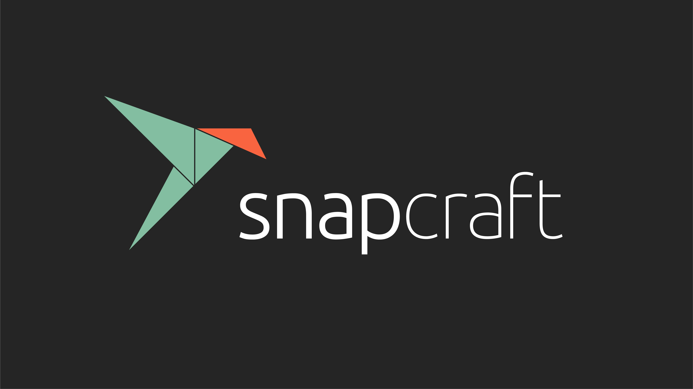
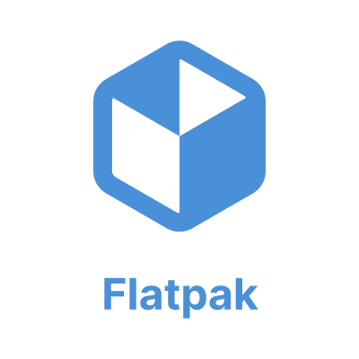

# Laboratório de Linux para Iniciantes

Laboratório de como instalar, configurar e utilizar distribuições Linux para quem nunca utilizou Linux.

Neste tutorial a distribuição linux utilizada é o Ubuntu. A escolha dessa distribuição se deve a sua popularidade e
facilidade de uso. Uma vez tendo dominado o Ubuntu, pode-se migrar para qualquer outra distribuição Linux.

## Tecnologias utilizadas

Tecnologias utilizadas neste laboratório.

    
    
    
    
    
    
    
    

## Onde Aplicar

Este projeto pode ser aplicado em diversas situações:
- Quando se deseja aprender a utilizar Linux.
- Quando não se tem conhecimento prévio de Linux.

## Roadmap

### STEP 1 - Instalação da Distribuição

[Instalar distribuição](desktop/instalar-distribuicao/README.md)

### STEP 2 - Instalação dos Programas

[Instalar programas](desktop/instalar-programas/README.md)

### STEP 3 - Configuração da Distribuição

[Configurar distribuição](desktop/configurar-distribuicao/README.md)

### STEP 4 - Dicas de Utilização

[Dicas de utilização](desktop/dicas/README.md)

### Desafio

[Desafio](desafio/README.md)

## Contato

Henrique Mendonça Castelar Campos - [henriquemendonacastelar@gmail.com](mailto:henriquemendonacastelar@gmail.com)

GitHub: [github.com/Henriquemcc](https://github.com/Henriquemcc)

## License

Este projeto é licenciado sob a [MIT License](https://mit-license.org/) - veja o arquivo [LICENSE](LICENSE) para mais detalhes.