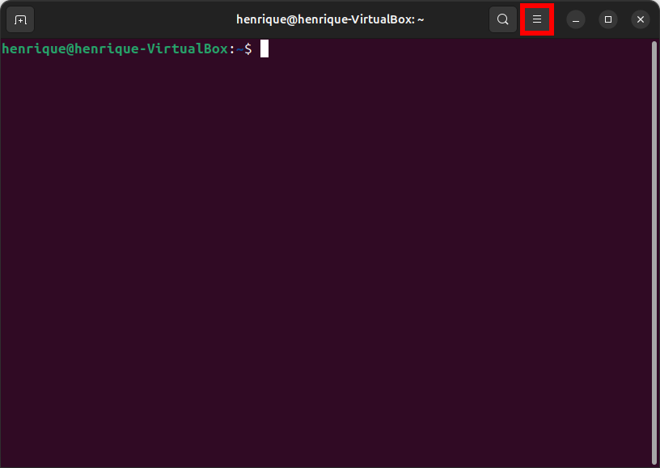
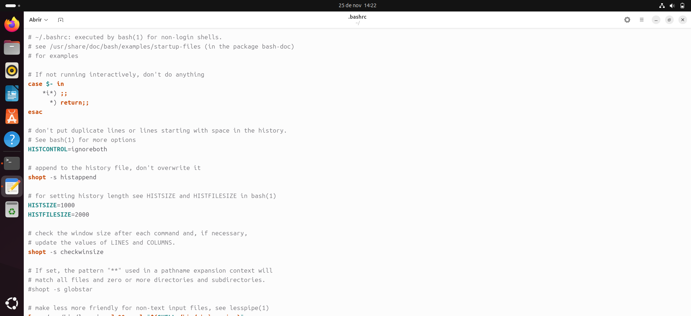

# Configurar distribuição

## Personalizar o Gnome Shell

O ambiente de trabalho Gnome Shell pode ser customizado.

### Alterar ícones e estilos visuais

É possível alterar os ícones de programas e estilos de janelas no Gnome Shell. Para isso, é necessário instalar o GNOME Tweak Tool.

Para instalar o Gnome Tweak Tool, no terminal, digite o seguinte comando:

```
sudo apt install gnome-tweak-tool
```

Após ter instalado o Gnome Tweak Tool, na barra de pesquisa do Gnome (aberta pela tecla 'Super' ('Símbolo do Windows') no teclado), busque por 'Ajustes' (se a sua distro estiver em português) ou 'Tweaks' (se a sua distro estiver em inglês).

**Cuidado: Um [bug conhecido](https://askubuntu.com/questions/1513701/gnome-tweak-tool-crashes-ubuntu-24-04lts-with-gnome-v46) do Gnome Tweak Tool é que ele pode crashar o sistema. Use-o por sua conta e risco.**

### Instalação de extensões

É possível instalar extensões no Gnome Shell. As extensões permitem mudar o comportamento padrão do Gnome Shell.

Para instalar extensões, acesse: https://extensions.gnome.org

**Cuidado: As extensões do Gnome Shell são mantidas e desenvolvidas pela comunidade. Elas podem ser infectadas ou conterem malware (vírus). Use por sua conta e risco.**

#### Exemplos de extensões

##### [Dash to Dock](https://extensions.gnome.org/extension/307/dash-to-dock/)


Legenda: Captura de tela do Gnome Shell com a extensão Dash to Dock.

##### [Bing Wallpaper](https://extensions.gnome.org/extension/1262/bing-wallpaper-changer/)


Legenda: Captura de tela do Gnome Shell com a extensão Bing Wallpaper.

##### [Hibernate Status Button](https://extensions.gnome.org/extension/755/hibernate-status-button/)


Legenda: Captura de tela do Gnome Shell com a extensão Hibernate Status Button. 

## Ativar atualizações automáticas em 2º plano

É possível ativar atualizações automáticas software em 2º plano, de modo que quem estiver utilizando o computador não vai perceber que o sistema e os programas estão sendo atualizados.

Para isso, basta instalar o pacote ```unattended-upgrades```, por meio do gerenciador de pacotes APT:

```
sudo apt install unattended-upgrades
```

## Personalizar o shell do Linux

O terminal do Linux pode ser customizado.


Legenda: Terminal padrão do Ubuntu.

### Alterar as cores

Para alterar as cores do terminal, no canto superior, clique no botão Opções, e um menu de contexto abrirá.



Legenda: Opções do Terminal do Ubuntu.

E depois clique no botão 'Preferências'. E uma nova janela se abrirá com as preferências do terminal.


Legenda: Menu de contexto de Opções do Terminal do Ubuntu, com 'Preferências' selecionado.

Em baixo de 'Perfis', clique em 'Sem nome'.


Legenda: Preferências do Terminal, com 'Sem nome' de 'Perfils' selecionado.

Clique na aba 'Cores'.


Legenda: Preferências do Terminal, no perfil 'Sem nome', com a aba 'Cores' selecionada.

Neste menu é possível alterar as cores do terminal do Ubuntu. Nele é possível alterar a cor do plano de fundo. Além da palheta de cores do texto.


Legenda: Opções de cores no Terminal do Ubuntu para o perfil 'Sem nome'

Ao desmarcar a opção 'Usar cores do tema do sistema', e em 'Esquemas embutidos' selecionar 'GNOME Claro' obtém-se o seguinte tema:


Legenda: Terminal do Ubuntu com o tema 'GNOME claro'.

### Alterar mensagem do terminal

Para alterar a mensagem mostrada no terminal, abra em um editor de texto o arquivo ```~/.bashrc```.

Exemplo: Para utilizar o Editor de Texto do Gnome, no terminal, digite:

```
gnome-text-editor ~/.bashrc
```



Legenda: Arquivo .bashrc aberto no Gnome Text Editor.

Ao abrir o arquivo .bashrc, altere a variável ```PS1``` para a mensagem que deseja exibir.

#### Exemplo: Exibindo "olá mundo" no terminal

Adicione esta linha no final do arquivo ```.bashrc```:

```
PS1="olá mundo";
```

O resultado será:


Legenda: Resultado da alteração do valor da variável PS1 para "olá mundo".

#### Exemplo: Exibindo o caminho atual, com o usuário atual e o nome do computador

Adicione esta linha no final do arquivo ```.bashrc```:

```
PS1="[$(whoami)@$(hostname) $(pwd)]$ ";
```

O resultado será:


Legenda: Resultado da alteração do valor da variável PS1 para "[$(whoami)@$(hostname) $(pwd)]$ ".