# Instalar distribuição

## Importante

## Roadmap

### STEP 1 - Download da imagem de instalação

Acesse a página de download da distribuição Ubuntu para Desktop em: https://ubuntu.com/download/desktop

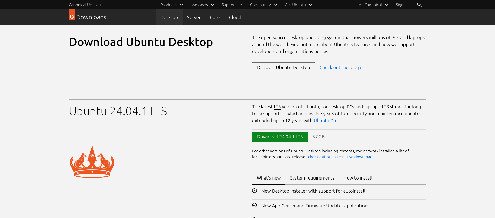

Clique no ícone em verde 'Download 24.04.1 LTS'.

E o arquivo 'ubuntu-24.04.1-desktop-amd64.iso' será baixado. Aguarde o fim do download desse arquivo e siga para o
próximo passo.

### STEP 2 - Gravar a imagem de instalação

Após ter baixado a imagem de instalação do Ubuntu, será necessário gravá-la em uma mídia física. Para isso será
necessário um pendrive que possa ser formatado.

Para gravar a imagem do Ubuntu em um pendrive existem várias ferramentas que podem ser utilizadas. Segue o passo a passo
de cada ferramenta

**Cuidado: Ao gravar uma imagem de instalação em um pendrive, todos os dados desse pendrive serão apagados.**

#### Opção 1 - Ventoy

##### STEP 2.1 - Acesse a página de download do Ventoy em: https://www.ventoy.net/en/download.html

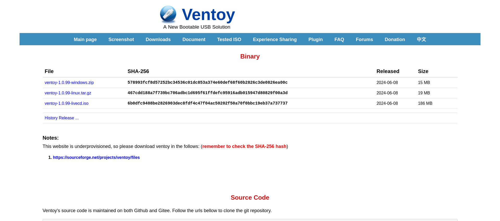

##### Windows

##### STEP 2.2 - Caso o seu sistema operacional seja o Windows, clique no link 'ventoy-1.0.99-windows.zip'. E o arquivo 'ventoy-1.0.99-windows.zip' será baixado. Extraia o arquivo baixado.

##### STEP 2.3 - Após extraír os arquivos do Ventoy, na pasta 'ventoy-1.0.99', execute o arquivo executável 'Ventoy2Disk.exe'.

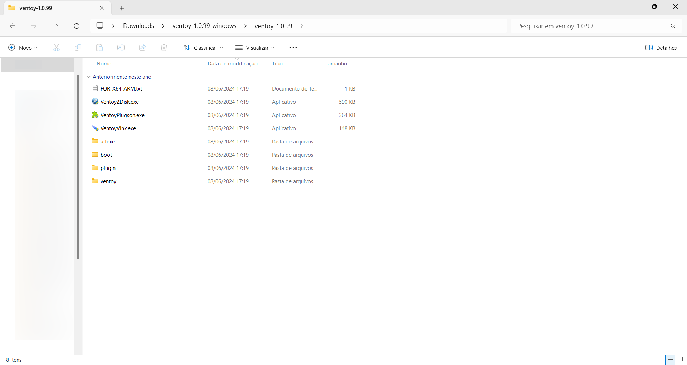

Legenda: Captura de tela da janela do Windows Explorer exibindo os arquivos do Ventoy.

##### STEP 2.4 - Ao executar o 'Ventoy2Disk.exe', uma janela se abrirá com as opções para instalar o Ventoy no pendrive.

Legenda: Captura de tela do programa Ventoy2Disk.

##### STEP 2.5 - Em 'device', selecione o pendrive que deseja instalar o Ventoy. E depois clique em 'Install'.

Após instalar o Ventoy no pendrive, duas partições serão montadas no Windows Explorer: 'Ventoy' e 'VTOYEFI'.

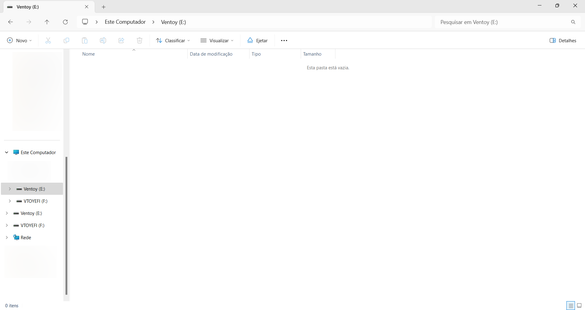

##### STEP 2.6 - Copie o arquivo 'ubuntu-24.04.1-desktop-amd64.iso' para dentro da partição 'Ventoy'.

Legenda: Captura de tela do Windows Explorer mostrando a partição 'Ventoy'. Note no canto esquerdo a partição 'VTOYEFI'.

##### Linux

##### STEP 2.2 - Caso esteja em uma máquina com Linux, clique no link 'ventoy-1.0.99-linux.tar.gz'. E o arquivo
'ventoy-1.0.99-linux.tar.gz' será baixado.

##### STEP 2.3 - Após extraír o arquivo 'ventoy-1.0.99-linux.tar.gz', abra o arquivo executável 'VentoyGUI.x86_64'.

Legenda: Captura de tela da janela do Gnome Files no Linux exibindo os arquivos do Ventoy.

##### STEP 2.4 - Ao executar o 'VentoyGUI.x86_64', uma janela se abrirá com as opções para instalar o Ventoy no pendrive.

Legenda: Captura de tela do programa Ventoy2Disk.

##### STEP 2.5 - Em 'device', selecione o pendrive que deseja instalar o Ventoy. E depois clique em 'Install'.

Após instalar o Ventoy no pendrive, a partição 'Ventoy' será montada no Files:

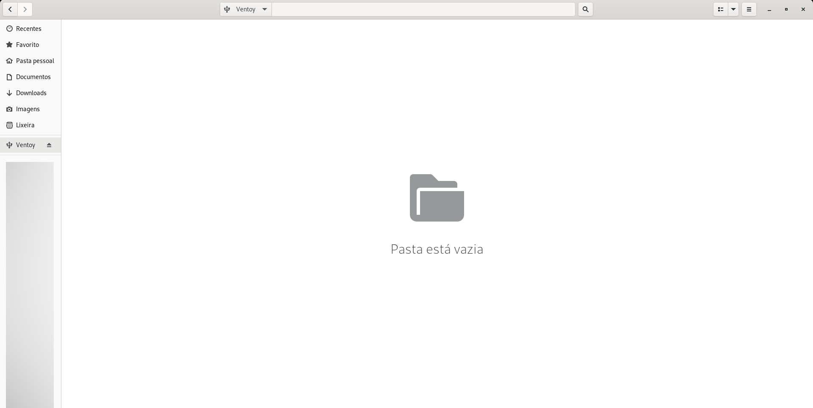

Legenda: Captura de tela do Files do Linux mostrando a partição 'Ventoy'.

##### STEP 2.6 - Copie o arquivo 'ubuntu-24.04.1-desktop-amd64.iso' para dentro da partição 'Ventoy'.

#### Opção 2 - Rufus (somente Windows)

##### STEP 2.1 - Acesse a página de download do Rufus em: https://rufus.ie/pt_BR/

##### STEP 2.2 - Em 'Download', clique no link 'rufus-4.6.exe'. E o arquivo 'rufus-4.6.exe' será baixado.

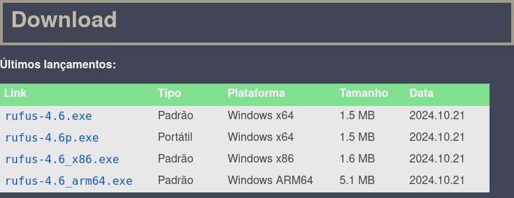

##### STEP 2.3 - Execute o arquivo baixado. E uma janela se abrirá.

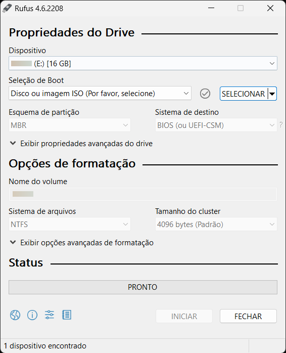

##### STEP 2.4 - Em 'Dispositivo', selecione o dispositivo USB que deseja gravar a imagem.

##### STEP 2.5 - Depois, clique em selecionar, e selecione o arquivo 'ubuntu-24.04.1-desktop-amd64.iso' baixado.

##### STEP 2.6 - E no final, clique em 'Iniciar', e a imagem de instalação será gravada no pendrive.

#### Opção 3 - Balena Etcher

##### STEP 2.1 - Acesse a página de download do Balena Etcher em: https://etcher.balena.io/#download-etcher

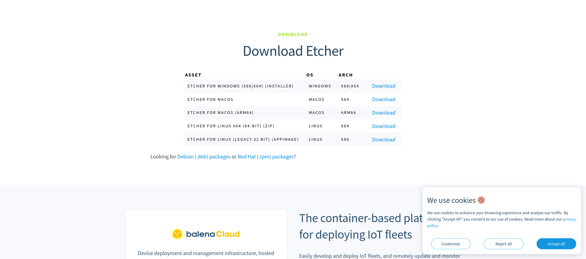

##### STEP 2.2 - Clique no link 'Download' correspondente ao seu sistema operacional.

##### STEP 2.3 - Execute o arquivo baixado.

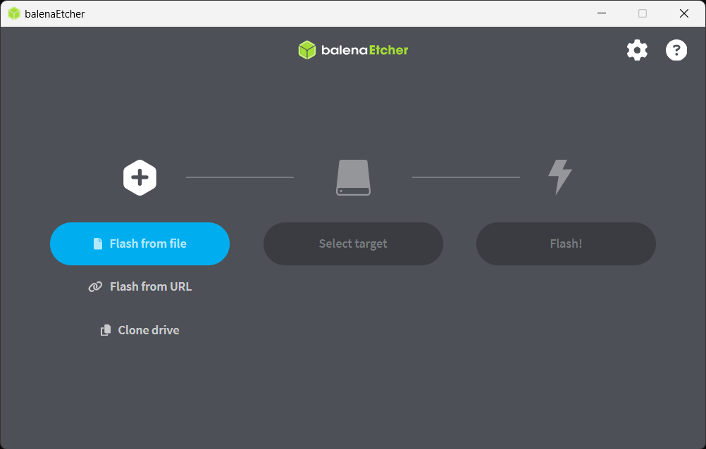

Legenda: Captura de tela do Balena Etcher.

##### STEP 2.4 - Clique em 'Flash from file' e selecione o arquivo 'ubuntu-24.04.1-desktop-amd64.iso'. 

##### STEP 2.5 - Depois, clique em 'Select target', e selecione o dispositivo USB que deseja gravar a imagem.

##### STEP 2.6 - E no final, clique em 'Flash!'.

### STEP 3 - Inicializar imagem de instalação

No computador onde deseja instalar o Ubuntu, siga os seguintes passos:

##### STEP 3.1 - Desligue o computador.

##### STEP 3.2 - Insira o pendrive em uma porta USB.

##### STEP 3.3 - Ligue o computador.

##### STEP 3.4 - Pressione a tecla que exibe os dispositivos para boot (Esta tecla é específica para cada modelo de computador. Geralmente é F12 ou F8. Caso não saiba, pesquise na Internet).

##### STEP 3.5 - Na tela de boot selecione o pendrive, e pressione ENTER.

##### STEP 3.6 - Caso tenha gravado o Ventoy no pendrive, selecione 'ubuntu-24.04.1-desktop-amd64.iso'.

E a imagem de instalação do Ubuntu será inicializada.

### STEP 4 - Instalar a distribuição

##### STEP 4.1 - Caso a tela do GRUB apareça, selecione 'Try or Install Ubuntu', e pressione ENTER.

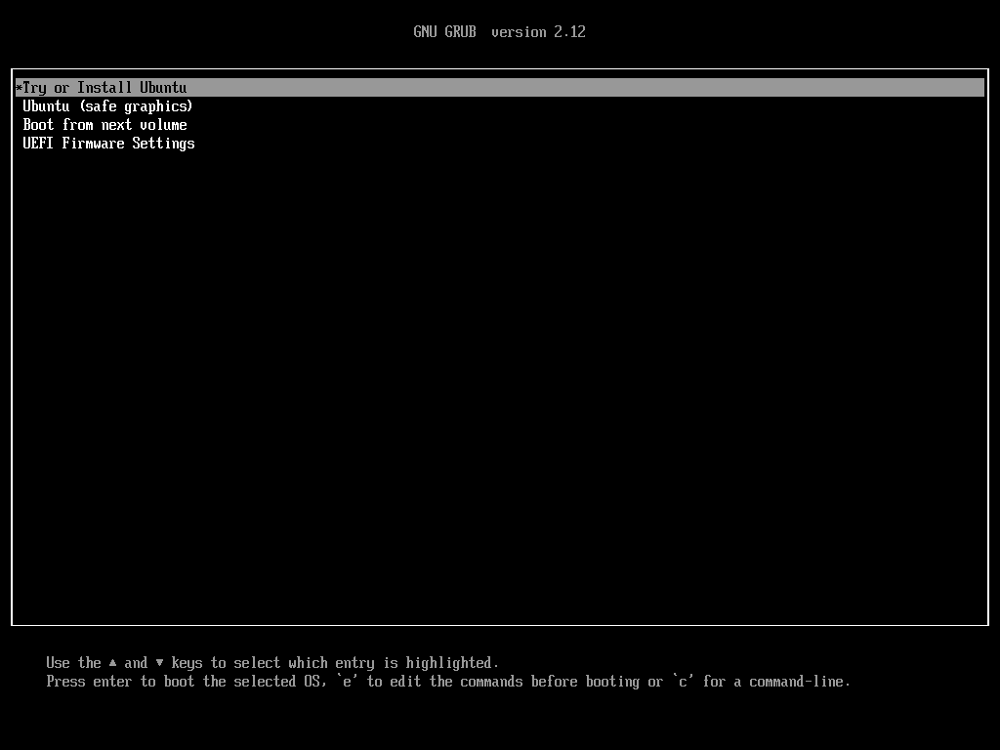

Legenda: Tela do GRUB.

E a tela de inicialização do Ubuntu aparecerá.

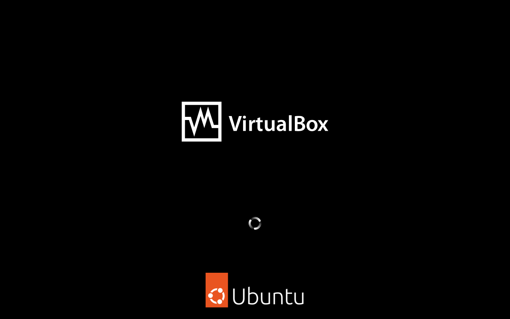

Legenda: Tela de inicialização do Ubuntu.

O Ubuntu inicializará e uma janela escrito 'Welcome to Ubuntu' abrirá.

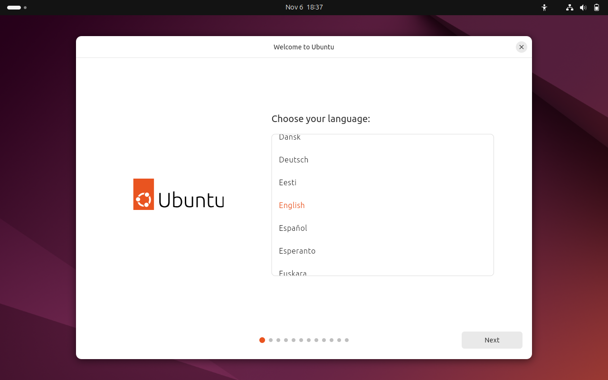

Legenda: Ubuntu com o programa de instalação com o título 'Welcome to Ubuntu'.

##### STEP 4.2 - Selecione o idioma 'Português do Brasil', e clique em 'Próximo'.

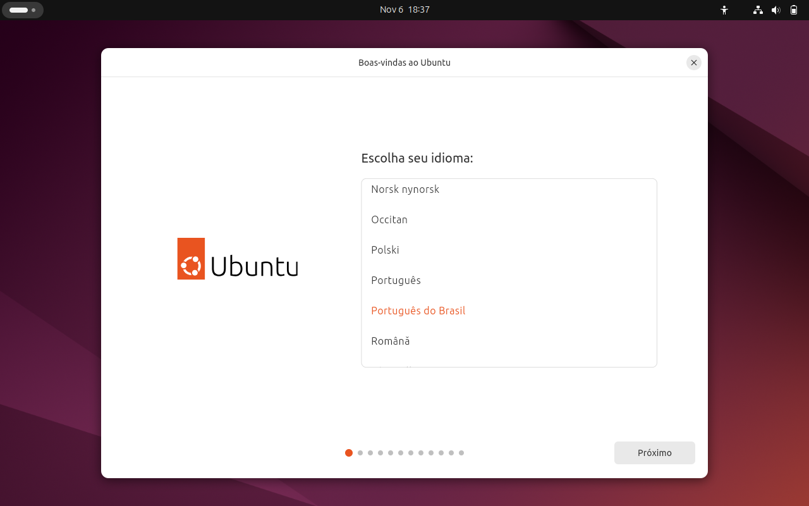

Legenda: Ubuntu com o programa de instalação com o título 'Boas-Vindas ao Ubuntu' em Português do Brasil.

##### STEP 4.3 - Em opções de acessibilidade, caso não possua nenhuma necessidade de acessibilidade, clique em 'Próximo'.

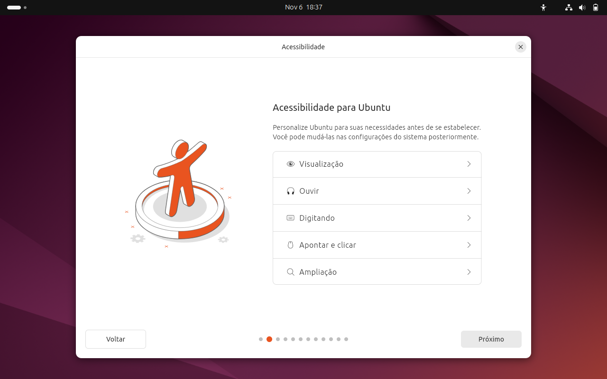

Legenda: Ubuntu com o programa de instalação com o título 'Acessibilidade'.

##### STEP 4.4 - Em layout do teclado, selecione o layout do seu teclado.

Caso o seu computador tenha sido comprado no Brasil, selecione o layout 'Português (Brasil)'. Caso o teclado de seu computador tenha outro layout selecione esse layout ou clique em 'Detectar'.

E no final na caixa de texto 'Digite aqui para testar o seu teclado', digite as teclas do seu teclado, e verifique se elas estão aparecendo corretamente.

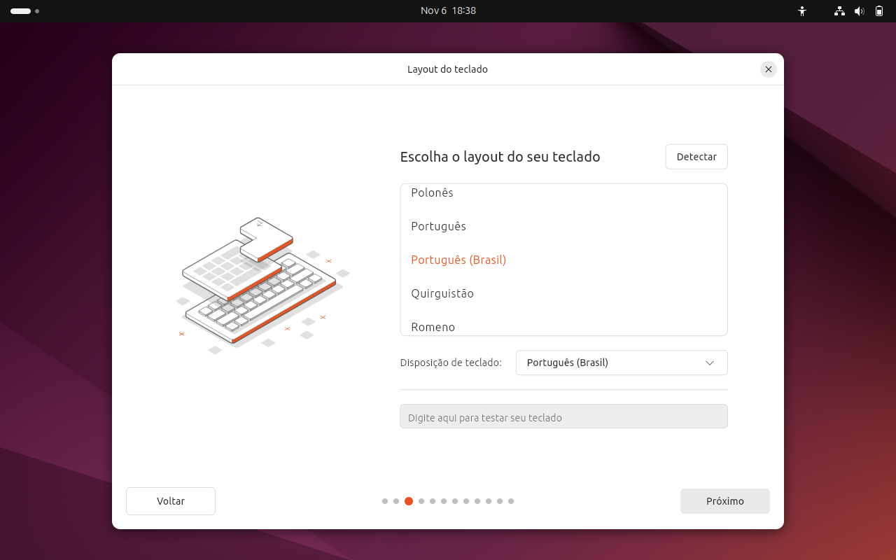

Legenda: Ubuntu com o programa de instalação com o título 'Layout do Teclado'.