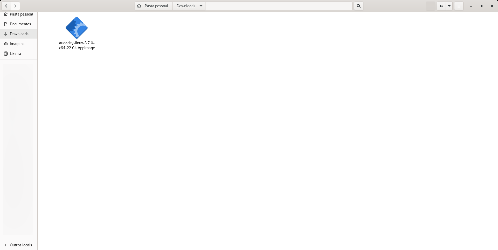
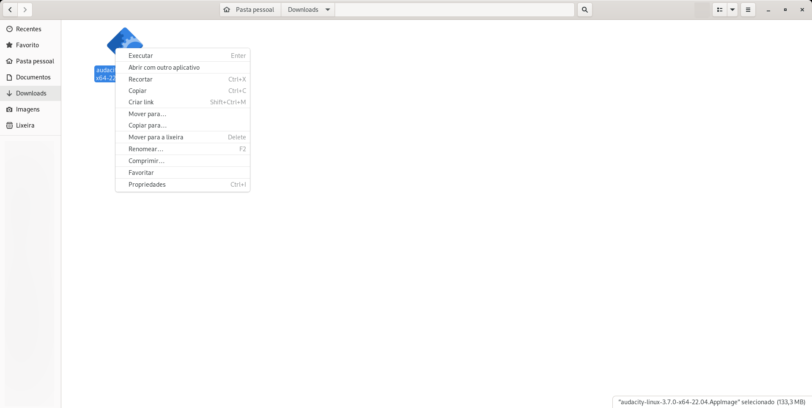
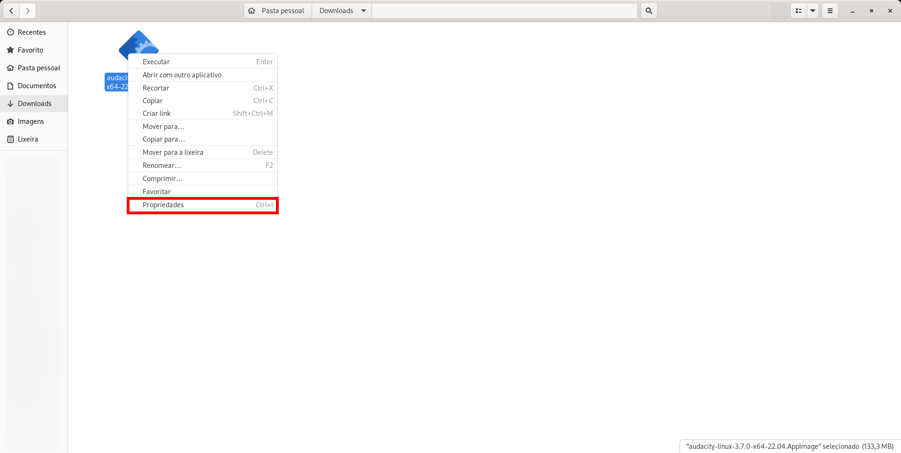
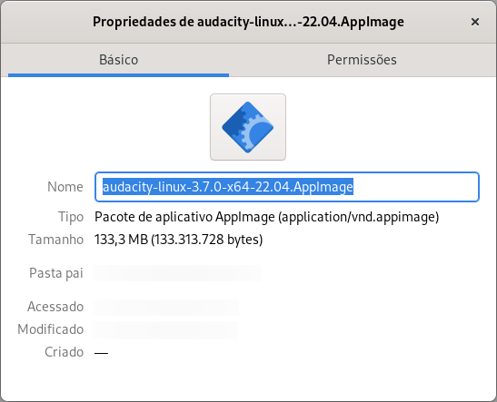
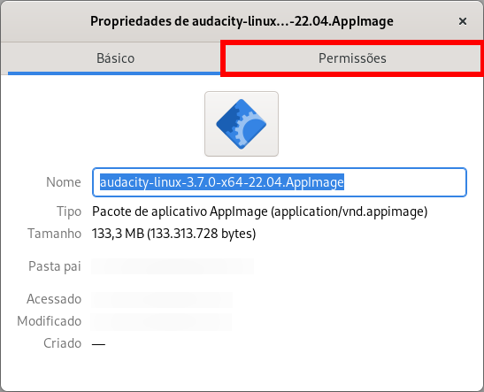
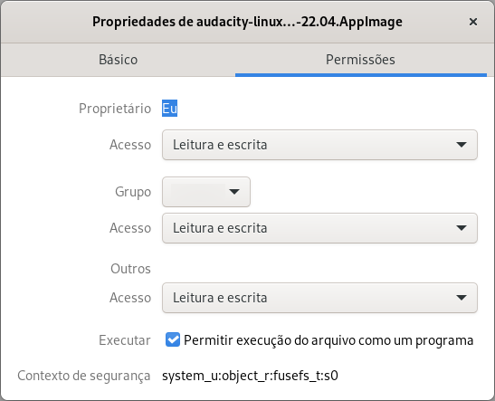
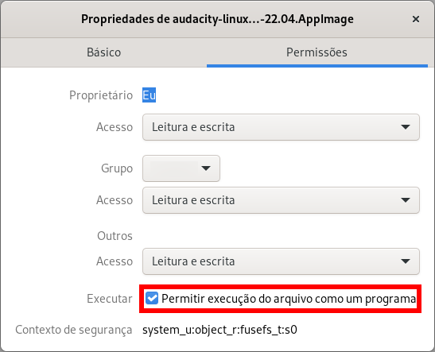
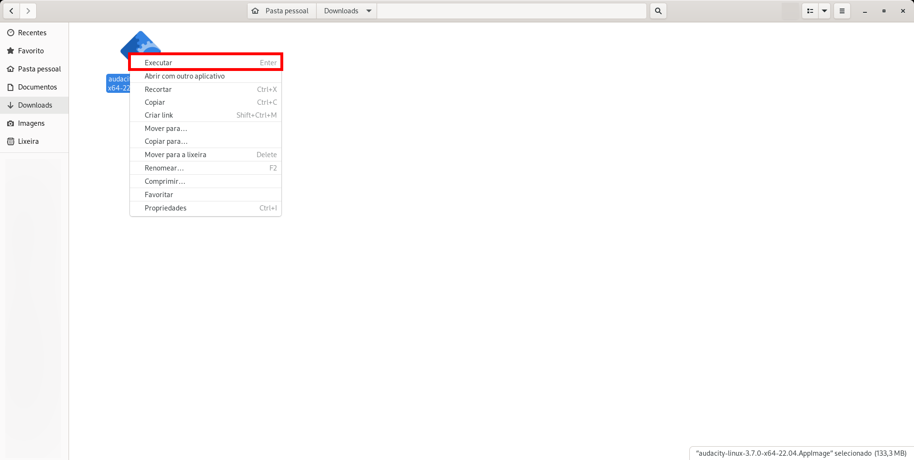

# AppImage

O AppImage é um meio de distribuir programas portáteis para diferentes distribuições Linux. Nele, basta baixar um único arquivo executável, e este arquivo pode ser executado em qualquer distribuição Linux, sem necessitar de instalação.

## Baixando AppImages

O download de executáveis AppImages deve ser feito no site do desenvolvedor.

Para encontrar por AppImages, basta acessar: https://appimage.github.io/apps/

**Cuidado: Arquivos '.AppImage', como qualquer outro arquivo executável, podem conter malware (vírus). Baixe arquivos '.AppImage' somente de fontes confiáveis.**

## Executando AppImages

### Interface gráfica

#### Alterando permissões

Após baixado um arquivo AppImage, é necessário alterar a permissão dele para torná-lo executável.

Para isso, no gerenciador de arquivos, clique com o botão direito no arquivo baixado.



No menu de contexto, clique em 'Propriedades'.





Na janela de propriedades do arquivo baixado, vai na aba 'Permissões'.





Na aba permissões, marque a checkbox 'Permitir execução do arquivo como programa.'

E feche a janela de propriedades do arquivo.





#### Executando executável

No gerenciador de arquivos, clique com o botão direito no arquivo baixado cujas permissões foram alteradas.


No menu de contexto, clique em 'Executar'.



### Linha de comando

Após baixado um arquivo AppImage, é necessário alterar a permissão dele para torná-lo executável. Para isso, no terminal, na pasta onde foi baixado o programa, digite o seguinte comando:

```
chmod a+x <nome-do-arquivo.AppImage>
```

E para executar o AppImage, no terminal, na pasta onde foi baixado o programa, digite o seguinte comando:

```
./<nome-do-arquivo.AppImage>
```

## Exemplos de programas

Exemplos de programas que podem ser baixados e executados por meio do AppImage.

[Bitwarden](https://bitwarden.com/download/)

[Balena Etcher](https://etcher.balena.io/)

[OpenShot](https://www.openshot.org/download/)

[Kdenlive](https://kdenlive.org/en/download/)

[Audacity](https://www.audacityteam.org/download/linux/)

[Packet Tracer (não oficial)](https://github.com/Diolinux/PacketTracer-AppImage/releases/tag/Packet-Tracer-AppImage-8.2.2)