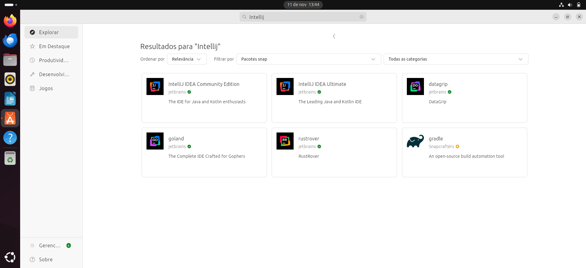
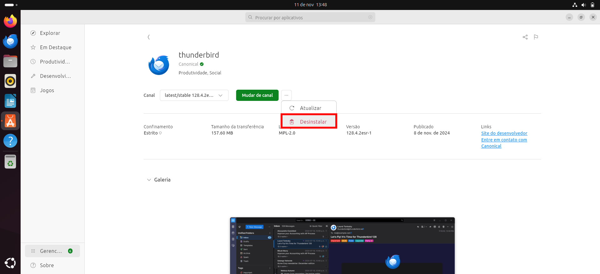

# Loja de Aplicativos (App Center)

O Ubuntu vém com uma loja de aplicativos instalada. Ela permite buscar, instalar, desinstalar e atualizar aplicativos sem a necessidade de digitar nenhum comando.

Legenda: Captura de tela da página inicial do Ubuntu App Center.

## Busca por aplicativo

Para buscar por um aplicativo, basta clicar na barra de pesquisa e digitar as palavras-chave desejadas (o nome do programa, por exemplo).

Legenda: Exemplo de busca por aplicativo.

## Instalação de aplicativo

Ao encontrar o aplicativo que deseja instalar, basta clicar em seu card, e a página do programa abrirá.

Legenda: Exemplo de página de programa

Para instalar o programa, basta clicar no botão 'Instalar' ('Install') em verde.

Legenda: Exemplo de página de programa, com o programa sendo instalado.

## Listagem de aplicativos instalados

Para listar os aplicativos instalados, na barra de navegação (no canto esquerdo), clique em 'Manage' (Gerenciar), e uma página com os aplicativos instalados aparecerá.

Legenda: Menu de gerenciamento de aplicativos.

Nessa página será mostrado todos os aplicativos instalados. E caso algum aplicativo esteja desatualizado, será mostrada a opção para atualizá-lo.

## Desinstalação de aplicativo

Para desinstalar um aplicativo, basta procurá-lo na barra de busca, ou listá-lo no menu de gerenciamento de aplicativos.

Ao encontrar o aplicativo que deseja desinstalar, basta clicar no seu card, e a sua página abrirá.

Legenda: Exemplo de página de programa.

Clique no botão "...", e depois em "Desinstalar".

Legenda: Exemplo de página de programa, mostrando o botão desinstalar.

E aparecerá no local do botão "..." o botão "Desinstalando".

Legenda: Exemplo de página de programa, sendo desinstalado.

## Atualização de aplicativo

Para atualizar todos os aplicativos, acesse o menu de gerênciamento de aplicativos, e clique em 'Atualizar tudo'.

Para atualizar um aplicativo específico, basta procurá-lo na barra de busca, ou listá-lo no menu de gerenciamento de aplicativos.

Ao encontrar o aplicativo que deseja atualizar, basta clicar no seu card, e a sua página abrirá.

Clique no botão "...", e depois em "Atualizar".

E aparecerá no local do botão "..." o botão "Atualizando".

